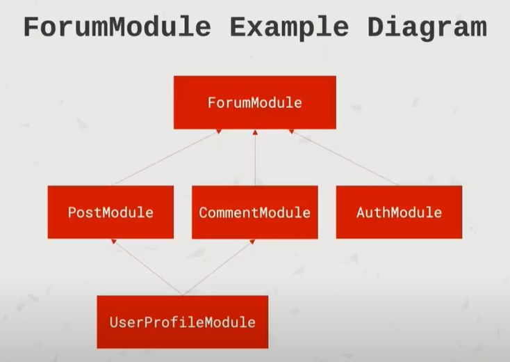
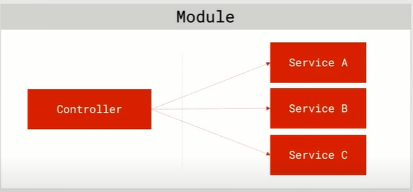

# NestJS

NestJS from zero to hero

# **lecture/01-NestJS**

# **lecture/02-installing-the-NestJS**

```bash
npm i -g @nestjs/cli
```

> After installed, using `nest --version` to check current nestjs

# **lecture/03-project-overview**

## **AppModule (root)**

| TasksModule           | AuthModule     |
| --------------------- | -------------- |
| TasksController       | AuthController |
| TasksService          | AuthService    |
| TasksEntity           | UserRepository |
| TasksRepository       | UserEntity     |
| Status ValidationPipe | JwtStratery    |
| ...                   | ..             |

## **API Endpoints Tasks**

| Endpoints         | Methods | Description               |
| ----------------- | ------- | ------------------------- |
| /tasks            | GET     | Get tasks (incl. filters) |
| /tasks/:id        | GET     | Get a tasks               |
| /tasks            | POST    | Create a task             |
| /tasks/:id        | DELETE  | Delete a task             |
| /tasks/:id/status | PATCH   | Update a task             |
| ---               | ---     | ---                       |
| /auth/signup      | POST    | Sign up                   |
| /auth/signin      | POST    | Sign in                   |

## **Objectives: NestJS**

- NestJS Modules
- NestJS Controllers
- NestJS Services and Providers
- Controllers-to-Service communication.
- Validation using NestJS Pipes

## **Objectives: Back-end && Architecture**

- Develop production-ready REST APIs
- CRUD operations (Create, Read, Update, Delete)
- Error handling
- Data Transfer Objects (DTO)
- System modularity
- Back-end development best practices
- Configuration Management
- Logging
- Security best practices

## **Objectives: Persistence**

- Connecting the application to a database
- Working with relational databases
- Using TypeORM
- Writing simple and complex queries using QueryBuilder
- Performance when working with a database

## **Objectives: Authorization/Authentication**

- Signing up/ signin in
- Authentication and Authorization
- Protected resources
- Ownership of tasks by users
- Using JWT tokens (JSON Web Tokens).
- Password hashing, salts and properly storing passwords

## **Objectives: Deployment**

- Polishing the application for Production use
- Deploying NestJS apps to AWS(Amazong Web Services)
- Deploying front-end applications to Amazon S3
- Wiring up the front-end and back-end

# **lecture/04-creating-a-project-via-the-cli**

- creating project via the cli

```bash
nest new nestjs-task-management
```

# **lecture/05-introduction-to-modules**

- Each application has at least one module - the root module. That is the starting point of the application..

- Modules are an effective way to organize components by a closely related set of capabilities (e.g. per feature).

- It is a good practice to have a folder per module, containing the module's components

- Modules are `singletons`, therefore a module can be imported by multiple other modules.

## Defining a module

A module is definded by annotating a class with the `@Module` decorator.

The decorator provides metadatas that Nest users to organize the application structure.

## @Module Decorator Properties

- `providers` : Array of providers to be available within the module via dependency injection.
- `controller` : Array of controllers to be instantiated within the module.
- `exports` : Array of providers to export to other modules.
- `imports` : List of modules required by this module. Any exported provider by these modules will now be available in our module via dependency injection

## ForumModule Example Diagram




# **lecture/06-Creating a Project | Module Scalable API | Modern TypeScript | JS**

> Pattern

```bash
nest g module module_name
```

> Bash

```bash
nest g module tasks
```

# **lecture/07-Creating a Controller in NestJS | Scalable API | Modern TypeScript**

## NestJS controllers

Responsible for handling incoming `requests` and returning `responses` to the client

Bound to a specific `path` (for example, `"/tasks"` for the task resource).

Contain handlers, which handle endpoints and request methods (`GET`, `POST`, `DELETE`, etcetera).

Can take advantage of dependency injection to consume providers within the same module.

## Defining a Controller

Controller are definded by decorating a class with the `@Controller` decorator.

The decorator accepts a string. which is the `path` to be handled by the controller.


## Defining a handlers

Handler are simply methods within the controller class, decorated with decorators such as `@Get`, `@Post`, `@Delete` etcetera.


## HTTP request incoming

- Request routed to Controller, handler is called with arguments
  - NestJS will parse the relevant request data and it will be available in the handler.
- Handler handles the request

  - Perform operations such as communication with a service. For example, retrieving an item from the database.

- Handler returns response value
  - Response can be of any type and even and exception. Nest will wrap the returned value as an HTTP response and return it to the client.

| AuthController <br>`/auth`         | TasksController <br>`/tasks`              | UsersController <br>`/users`         |
| ---------------------------------- | ----------------------------------------- | ------------------------------------ |
| signin()<br> `POST /auth/signin`   | getAllTasks()<br> `GET /tasks`            | getUsers()<br> `GET /users/:id`      |
| signout()<br> `POST /auth/signout` | getTaskById()<br> `GET /tasks/:id`        | createUser()<br> `POST /users`       |
|                                    | createTask()<br> `POST /tasks`            | deleteUser()<br> `DELETE /users/:id` |
|                                    | deleteTask()<br> `DELETE /task/:id`       |                                      |
|                                    | updateTaskStatus()<br> `PATCH /tasks/:id` |                                      |

# **lecture/08-Creating a Controller Via CLI**

⚠️ Don't forget `cd to nestjs-task-management`

```bash
nest g controller tasks --no-spec
```

# **lecture/09-NestJS Providers and Services**

## NestJS Providers

- Can be interested into constructors if decorated as an `@Injectable` via **dependency injection**.
- Can be a plain value, a class, sync/async factory etc.
- Providers must be provided to a module for them to be usable.
- Can be exported from a module - and then be available to other module that import it.

## What is a Service?

- Defined as providers. **Not all providers are services.**
- Common concept within software development and are not exclusive NestJS, JavaScript or back-end development.
- Singleton when wrapped with @Injectable() and provided to a module. That means, the same instance will be shared across the application - acting as a single source of truth.
- The main source of business logic. For example, a service will be called from a controller to validate data, create an item into database and return a response.



## Providers in Modules


## Dependency injection in NestJS

Any command within the NestJS ecosystem can inject a provider that it decorated with the `@Injectable`.

We define the dependencies in the constructor of the class. NestJS will take care of the injection for us, and it will then be available as a class property.


# **lecture/10-Creating a Tasks Service | Scalable API | Modern TypeScript | JS |**

```bash
nest g service tasks --no-spec
```

# **lecture/11-Getting all tasks**

> Coding!

# **lecture/12-Defining a task model**

> Coding!

# **lecture/13-Creating a task part 1**

> Coding!

# **lecture/14-Creating a task part 2**

> Coding!

# **lecture/15-Data transfer objects `dtos`**

## Understanding the problem

> `A data transfer object is an object that carries data between processes`

> `A Data Transfer Object is an object that is used to encapsulate data , and send it from one subsystem of an application to another.`

> `A DTO is an object that defines how the data will be sent over the network.`

## More about dtos

- Common concept in software development that is not specific to NestJS.
- Result in more bulletproof code, as it can be used as a TypeScript type.
- Do not have any behavior except for storage, retrieval, serialization and deserialization of its own data.
- Resolve in increased performance (although negligible in small applications).
- Can be useful for data validation
- A DTO is `NOT` a model definition. Its defines the shapes of data for a specific case, for example - creating a task.
- Can be defined using interface or a class.

## Classes VS Interfaces for DTOs

- Data Transfer Objects `(DTO)` can be defined as class or interface.
- The recommended approach is to use classes, also clearly documented in the NestJS documentation.
- The reason is that interfaces are a part of TypeScript and are not preserved post-compilation.
- Classes allows us to do more, and since they are a part of JavaScript, they will be preserved post-compilation.
- NestJS cannot refer to interfaces in run-time, but can refer to classes.

`TLDR: Classes are the way to go for DTOs.`

## Example DTOs

| CreateShippingDto <br>` POST /shipping` | UpdateShippingAddressDto<br>`PATCH /shipping/:id/address` | createTransitDto <br> `POST /transit` |
| --------------------------------------- | --------------------------------------------------------- | ------------------------------------- |
| orderId: string;                        | streetName: string                                        | deliveryIds: string[];                |
| deliveryAddress: Address;               | houseNumber: number                                       | driverId: string;                     |
| requiresSignature: boolean;             | zipCode: string                                           | vehicleNumber: number                 |
|                                         | city: string                                              | departureTime: UTCDate                |
|                                         | country: string                                           |

## Important note!

- Data Transfer Objects are **NOT** mandatory.
- You can still develop application without using DTOs.
- However, the value they add makes it worthwhile to use them when applicable.
- Applying the DTO pattern as soon as possible will make it easy for you maintain and refactor your code.

# **lecture/16-creating CreateTaskDto**

# **lecture/17-getting-a-task-by-id**

# **lecture/18-challenge-deleting-a-task**

## Challenge time!

> Deleting a Task

## Deleting a Task

- Incoming DELETE **HTTP** request
- The URL will contain the ID of the task to be deleted.
- Handle the request - extract the ID and delete the task

```URL
**DELETE** http://localhost:3000/task/cc4e4319-0cde-4280-a1dc-d9e197f5ab91
```

# **lecture/20-challenge-updating-a-task's status**

## Challenge time!

> Updating a Task's Status

## Updating a Task's Status

- Incoming **PATCH** HTTP request
- The URL will contain the ID of the task to be updated.
- The request body will contain the new status.
- Handle the request - extract the ID and the status, and update the task's status.

## `PATCH` best practice

- Refer to the resource in the URL;
- Refer to a specific item by ID;
- Provide the required parameters in the `request body`.

```API
`PATCH` http://localhost:3000/tasks/325d9273-53e1-4a1d-a960-101664328696
```

# **lecture/21-solution-updating-a-task-status**

# **22-feature-searching-and-filtering-tasks**

# **23-introduction-to-nestjs-pipes**

## NestJS Pipes

- Pipes operate on the `arguments` to be processed by the route handler, just before the handler is called.
- Pipes can perform `data transformation` or `data validation`.
- Pipes can return data - either original or modified - which will be passed on to the route handler.
- Pipes can throw exceptions. Exceptions thrown will be handled by NestJS and parsed into an error response.
- Pipes can be asynchronous.

## Default Pipes in NestJS

NestJS ships with useful pipes within the _@nestjs/common_ module.

> **ValidationPipe**
> Validates the compatibility of an entire object against a class (goes well will DTOs, or Data Transfer Objects). If any property cannot be mapped properly (for example, mismatching type) validation will fail.
>
> A very common use case, therefore having a build-in validation pipe is extremely useful.

> **ParseIntPipe**
> By default, arguments are of type `String`. This pipe validates that an argument is a number. If successful, the argument is transformed into a `Number` and passed on to the handler.

## Custom Pipe Implementation

- Pipes are classes annotated with the `@Injectable()` decorator.
- Pipes must implement the `PipeTransform` generic interface. Therefore, every pipe must have a `tranform()` method. This method will be called by NestJS to process the arguments.
- The `tranform()` method accepts two parameters:
  - `value` : the value of the processed argument.
  - `metadata` (optional): an object containing metadata about the argument.
- Whatever is returned from ther `tranform()` method will be passed on to the route handler. Exceptions will be sent back to the client.
- Pipes can be consumed in different ways.
- `Handler-level pipes` are defined at the handler level, via the `@UsePipes()` decorator. Such pipe will process all parameters for the incoming requests.
  

- `Parameter-level pipes` are defined at ther parameter level. Only the specific parameter for which the pipe has been specified will be processed.


- `Global pipes` are defined at the application level and will be applied to any incoming request.
  

## Parameter-level VS Handler-level pipes. Which one?

**It depends.**

**Parameter-level pipes** tend to be slimmer and cleaner. However, they often result in extra code added to handlers - this can get messy and hard to maintain.

**Handler-level pipes** require some more code, but provide some great benefits:

- Such pipes do not require extra code at the parameter level.
- Easier to maintain and expand. If the shape of the data changes, it is easy to make the necssary changes within the pipe only.
- Responsibility of indentifying the arguments to process is shifted to one central file - the pipe file
- Promote usage of DTOs (Data Transfer Objects) which is a very good practice.

# **23-ValidationPipe Creating a Task**

```bash
npm i class-validator class-transformer --save
```

After add add annotation to 2 files `tasks.controller.ts` and `create-task.dto.ts` -> Then, you open `PostMan` or `ThunderClient` for test api. You can see the result in the image below.


# **lecture/24-ValidationPipe-creating-a-task**

> Using `git diff <current-branch> <prev-branch>` to see different between branhc

# **lecture/25-error-handling-getting-a-non-existing-task**

> Using `git diff <current-branch> <prev-branch>` to see different between branhc

# **lecture/26-error-handling-deleting-a-non-existing-task**

> Using `git diff <current-branch> <prev-branch>` to see different between branhc

# **lecture/27-custom-pipe-validating-the-task-status**

> Using `git diff <current-branch> <prev-branch>` to see different between branhc

# **lecture/28-ValidationPipe-task-filtering-and-search**

> Using `git diff <current-branch> <prev-branch>` to see different between branhc

# **lecture/29-using-pgAdmin-to-create-a-database**

`Prerequire:`

- Install PostgreSQL

# **lecture/30-Object Relational Mapping (ORM) and TypeORM**

**Object Relational Mapping (ORM)**

- Object Relational Mapping (ORM) is a technique that lets you query and manipulate data from a database, using an object-oriented paradigm.

- There are many ORM libraries that allow developers to communicate to the database using their preferred programming language - rather than sending plain queries directly.

**`Pros` and `Cons` of using an ORM library**

> `Pros`

- Writing the data model being once place - easier to maintain. Less repetition.

- Lots of things done automatically - database handling, data types, relations etcetera.
- No need to write SQL syntax (easy to learn, hard to master). Using your natural way of coding.
- Database abstraction - you can change the database type whenever you wish.
- Leverages OOP, therefore things like inheritance are easy to achieve.

> `Cons`

- You have to learn it, and ORM libraries are not always simple.
- Performance is alright, but it's easy to neglect.
- Make is easy to forget (or never learn) what's happening behind the scenes, which can lead to a variety of maintainability issues.

**TypeORM**

- TypeORM is an ORM library that can run in Node.js and be used with TypeScript (or JavaScript).
- Helps us define and manage entities, repositories, columns, relations, replication, indices, queries, logging and `so much more`.

**Example**

- Retrieving all tasks owned by "_Kenneth_" and are of status "_DONE_"

```ts
// TypeORM
const tasks = await Task.find({ status: 'DONE', user: 'Kenneth' });
```

```js
// Pure JavaScript
let tasks;
db.query(
  "SELECT * FROM tasks WHERE status = 'DONE' AND user = 'Kenneth'",
  (err, result) => {
    if (err) {
      throw new Error('Could not retrieve tasks!');
    }
    tasks = result.rows;
  },
);
```

`⚠️ Read more!`[Link to TypeORM documentation](https://typeorm.io)

# **lecture/31-connecting-nestjs-to-a-database-using-typeorm**

```bash
yarn add @nestjs/typeorm typeorm pg
```

```bash
yarn add dotenv
```

```bash
npm i --save @nestjs/config
```

```bash
npm install -g win-node-env
```
